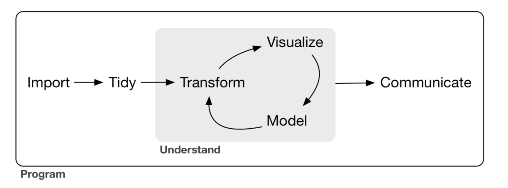

---
output:
  html_document: default
  pdf_document: default
  word_document: default
---

<h2 style='font-family: Optima;color:#ecac00'>
Máster en Big Data. Tecnología y Analítica Avanzada (MBD).
</h2>
</br>
<h2 style='font-family: Optima;color:#ecac00'>
Fundamentos Matemáticos del Análisis de Datos (FMAD). 2022-2023.
</h2>

<h1 style='font-family: Optima;color:#ecac00'>
Course Overview
</h1>

## Syllabus

+ [Available at this link](https://repositorio.comillas.edu/xmlui/bitstream/handle/11531/58917/Gu%C3%ADa%20Docente.pdf)

## Contact Info

+ Fernando San Segundo, [fsansegundo@comillas.edu](mailto://fsansegundo@comillas.edu). Office: D-412.
+ Santiago Fernández, [sfgonzalez@icai.comillas.edu](mailto://sfgonzalez@icai.comillas.edu). Office: D-201.  

Office hours to be announced (but please alway send us an email beforehand!).

## Moodle Site 

+ Use this link [Moodle](https://sifo.comillas.edu/course/view.php?id=38584). 


## Course Description

+ This course is a primer in Statistics with a special emphasis on its mathematical foundations. The subject aims to introduce the student to the language of Statistics and to basic, but fundamental, concepts such as distributions, probability inference and statistical models. Our approach is practical and conceptual, using the computational tools as a mean to gain an insight into the central ideas of Statistics.

+ The subject also provides a first course of the Python language by combining exposure of the main concepts in Statistics and tutorial Python sessions. Our focus will be in a modern but well established flavor of the Python language using libraries such as NumPy, Pandas, SciPy, Scikit-learn and Seaborn to describe the data analysis steps as a workflow.

+ We will also introduce some auxiliary tools that form an important part of the Python data analysis ecosystem. Git and GitHub have become a natural setting for collaborative work and communication inside a team.

+ The basic structure of the Data Analysis process is, according to Wickham and Grolemund (2016) this one:

We will learn how to use the foundational Python Data Science toolkit to follow all the steps of this process. 

+ This is the well known [Drew Conway's Diagram of Data Science](http://drewconway.com/zia/2013/3/26/the-data-science-venn-diagram):  
  
We will be exploring the upper part of this diagram, to provide you with the skills that you will need in other courses. 
  
+ The original Conway diagram warns about a danger zone that Data Science practitioners should avoid. But there is a second danger zone for Machine Learning applicatyions that you must be aware of, well illustrated by this [XKCD](https://xkcd.com/1831) cartoon:


## Software Setup and Previous Versions of the Code and Course Slides

+ Previous versions of this course used the R language. You can find the course slides for the last version at this [GitHub repository](https://github.com/mbdfmad/fmad2122). Python was chosen this year to meet the requirements of other courses in the MBD. But R is a very useful language to add to your data science toolbox and portfolio. We encourage you to take a look at the R material for this course 

+ We have prepared software setup instructions for:
    + [Windows users](01-Software_Setup_Windows_Version.ipynb)
    + [MacOS users](01M-Software_Setup_MacOS_Version.ipynb)
    
  If you are planning to use Linux for this course please let us know.

## Contents

+ **Unit 1. Types of Variables and Basic Data Structures**  
  1.1 The basic structure of a data analysis.  
  1.2 Types of variables and tabular data.  
  1.3 Basic computational tools and data skills.  
 
+ **Unit 2. Graphics and Exploratory Data Analysis**  
  2.1 The correspondence between basic variable type and graphs.  
  2.2 Common data science graph types using Python libraries.  
  2.3 Statistical summaries of data with pandas and NumPy.
 
+ **Unit 3. Distributions**  
  3.1 Distributions as theoretical models. Python skills necessary to work with distributions.  
  3.2 Measures of position and spread. Simulation of random processes and variables.
 
+ **Unit 4. Probability**  
  4.1 Discrete Probability. Laplace’s Rule and Bayes Theorem.  
  4.2 Axioms of Probability.  
  4.3 Contingency Tables.
 
+ **Unit 5. Random Variables**  
  5.1 Discrete Random Variables.  
  5.2 Binomial Variables.  
  5.3 Continuous Random Variables.  
  5.4 Normal Random Variables.

+ **Unit 6. Inference**  
  6.1 Sampling Distributions and Central Limit Theorem.  
  6.2 Confidence Intervals.  
  6.3 Hypothesis Test.
 
+ **Unit 7. Linear and Logistic Regression**  
  7.1 Covariance.  
  7.2 Linear Regression Model.  
  7.3 Logistic Regression Model.

+ **Unit 8. Bayesian Statistics**  
    8.1 Introduction to Bayesian Statistics.  
    8.2 Monte Carlo Methods and Bayesian Software.

## Course Grading

+ Quizzes: 10%
+ Final exam: 30%
+ Lab assignments: 35%
+ Final project (teamwork): 25%

## References

+ [Python Data Science Handbook](https://jakevdp.github.io/PythonDataScienceHandbook/) Vanderplas, J. (2016) O'Reilly. Freely available online.ISBN: 978-1491912058
+ [Python for Data Science.](https://nostarch.com/python-data-science) Vasiliev, Yuli. (2022) No Starch Press. ISBN-13: 978-1718502215 (ebook)
+ [Pandas in Action.](https://www.manning.com/books/pandas-in-action) Paskhaver, B (2021) Manning Publications Co. ISBN 978-1617297434
+ [Hands-On Data Analysis with Pandas, Second Edition.](https://www.packtpub.com/product/hands-on-data-analysis-with-pandas-second-edition/9781800563452) Molin, S (2021)  Packt Publishing Ltd. ISBN 978-1800563452
+ [R for Data Science.](https://r4ds.had.co.nz/index.html) Grolemund, G. and Wickham, H. (2017).  O’Reilly. Freely available online. ISBN- 13: 978-1491910399


```python

```
