<h2 style='font-family: Optima;color:#ecac00'>
Máster en Big Data. Tecnología y Analítica Avanzada (MBD).
</h2>
</br>
<h2 style='font-family: Optima;color:#ecac00'>
Fundamentos Matemáticos del Análisis de Datos (FMAD). 2022-2023.
</h2>

<h1 style='font-family: Optima;color:#ecac00'>
Software Setup, Windows Version
</h1>


## Before you proceed

+ Please, read this document completely before starting your setup, so as to get a general idea of what is coming. In particular, please read the final [*Alternative Setups*](#AlternativeSetups) section. If you have any doubts, we are happy to help.
+ **Be careful!** Another reason to read this document in advance is that we have seen too often users ruining their Python setups because of a rushed decision. Wrecking your system can be a matter of minutes, getting it back can take you hours or even days. 
Don't let the cartoon below be you!! When in doubt, please talk to us first.  
  

*Image from [XKCD](https://xkcd.com/1987/)* 


## Folder structure for the course

+ You should create a **specific folder** for this course under your user folder. Under Windows a typical location
could be something like (the ellipsis represents possible intermediate folders):

    `C:/Users/your_user_folder/.../MasterBD/FMAD/`  
        
          
+ **The folder that you have created will always be referred to in these notes as the Course Folder**. In the above examples we named it `FMAD` but you can give it any name you want. As usual, it is a good idea to keep it short and meaningful (and free of spaces, unusual characters, etc.) 
 
+ We will be using Git and [GitHub](https://github.com) repositories for the Course Notes and Assignments. In particular, the following repository will be used to share all the common course material:  
    [https://github.com/mbdfmad/fmad2223](https://github.com/mbdfmad/fmad2223)  
  In the next section we will tell you how to get a local copy of this repository to your computer. For the time being you can browse the contents of the repository, but do not download it yet! This repository **will always be referred to in these notes as the Common Repository**. Soon you will be also using your *personal repository* and it is important to get the distinction and name conventions right from the beginning. 

## Software Setup and First Steps

### Installing Git

**Important Note:** If you already have a working and recent setup of Git (current version is 2.37), skip to the [*Installing Anaconda Python*](#InstallingAnaconda) subsection.

+ Install [Git for Windows](http://gitforwindows.org) using this link. When asked about "Adjusting your PATH environment", select *Git from the command line and also from 3rd-party software*. 

  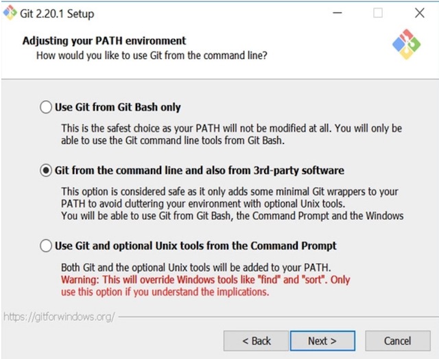
  
  For all the rest of the setup it is ok to accept the defaults.
  
+ When the Git setup is completed hit the Windows key and begin typing *Git Bash*. You should see results like this: 
  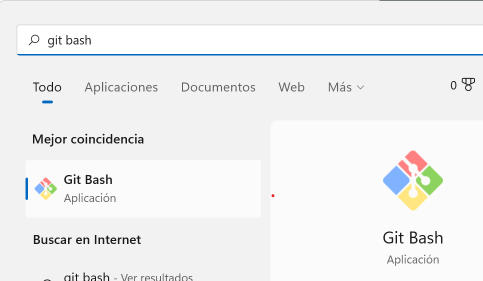
  
  Open the *Git Bash* application. A new *terminal* window will appear with a prompt waiting for your commands. 
  
  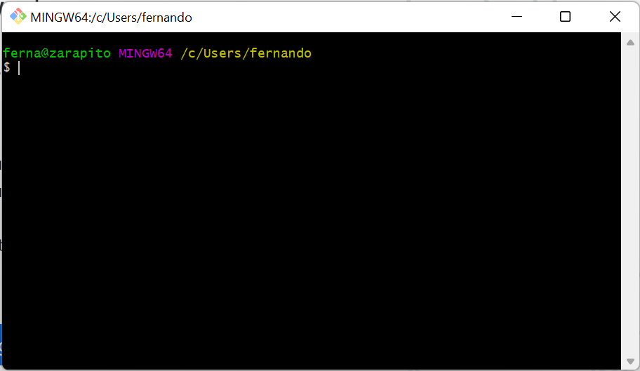
  

The details of the prompt (user and machine names) will be different in your case, of course. We will return here soon, but first we need a GitHub account.

### Create a GitHub account  

+ **Important Note:** even if you already have a GitHub account you need to have an account that is linked with your university email (the one ending in `@alu.comillas.edu`). You can create that account using [this link](https://github.com). Make sure to log out first if you were already logged with a *non-university-associated* account. And we recommend [reading this advice first](https://happygitwithr.com/github-acct.html#username-advice).

### Clone the *common repository* 

+ Using the *Git Bash terminal* navigate to the *Course Folder*. You can get there using the `cd` command. **Make sure that you have changed into the right folder before going further!!** You can use the `pwd` command to check your current location. Ask for help if you run into trouble.

+ In that folder run the following command:

    `git clone https://github.com/mbdfmad/fmad2223.git`
    
  Git will begin cloning (downloading) the contents of the repo to a folder named `fmad2223` in your computer. The process looks like this (the number of cloned objects will surely be greater in your case):
  
    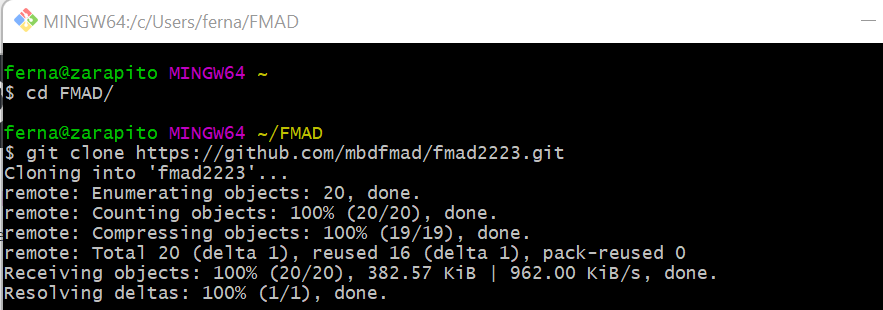
  
  The `fmad2223` folder will then be a subfolder of the *Course Folder*. You should consider this `fmad2223` folder as a *read-only* folder. You will soon see how to update its contents as the course progresses, but **you are not expected to directly modify the contents of the `fmad2223` folder** (and you shouldn't). You can *copy* any object from this folder (e.g. the code examples that we will provide) to other locations in your computer if you want to make changes. Finally, if you are a seasoned Git user you can opt for a fork of the repo instead of cloning it. 

### Keeping your local copy of the *common repository* updated.

+ If you are used to auto syncing tools such as Dropbox, OneDrive, ICloud Drive and the like, you must keep in mind that **Git repos are not auto-syncing**. To keep the information in your repos updated you have to manually update them (both ways, from your computer to GitHub and viceversa).

+ **This will be very important for our workflow in the lectures of the course.** So make sure to get it right, and ask for help soon if you need it. Every work session for this course will begin with the following ritual:
    + Open a *Terminal* (the Git Bash terminal or, see below, the Anaconda terminal are both ok).
    + Navigate to your local `fmad2223` folder. Do not confuse this with the *Course Folder*.
    + Run `git status` to check that everything is ok. 
    + Run `git pull origin main`. Depending on the update status of your local copy of the repo you will either download the new contents from the repo at GitHub or you will receive a message saying that you are `Already up to  date`.  
    + If you are going to modify any of the files in `fmad2223` and you want to keep the changes, **make sure to copy the files first to a different folder outside of the common repository.** Just create as many additional subfolders of the course folder as you see fit, but make so outside of the common repository. 
    
  Don't worry too much, however. You cannot break anything, since you won't have write permissions for this GitHub repo. Worst case scenario, you can (backup your local files and) delete the `fmad2223` folder and clone it again to get the latest contents.

    
### Setting up a local Git configuration for the Common Repository

+ Using still the *Git Bash* terminal, change into the `fmad2223` folder and set your local Git configuration with these commands (the first one is the folder change from the *Course Folder* to `fmad2223`):

  `cd fmad2223`  
  `git config --local user.name 'replace_this_with_your_GitHub_username'`  
  `git config --local user.email 'replace_this_with_your_university_email'`  
  `git config --global init.defaultBranch main`
  
+ By the way, if you are doing this setup for the first time, you can now close the *Git Bash* terminal window.   

### Installing Anaconda Python <a name="InstallingAnaconda"></a>

**Important Note:** If you already have a working setup of Anaconda Python (with Python 3.8 or 3.9) then skip to the [*Create a Conda Environment for the Course*](#CreateCondaEnv) subsection. If your Python version is older: get updated, people!


+ Begin by navigating to the [Anaconda Web Page](https://www.anaconda.com/):

    

+ Click the download link. When the download finishes, run the Anaconda Installer.

    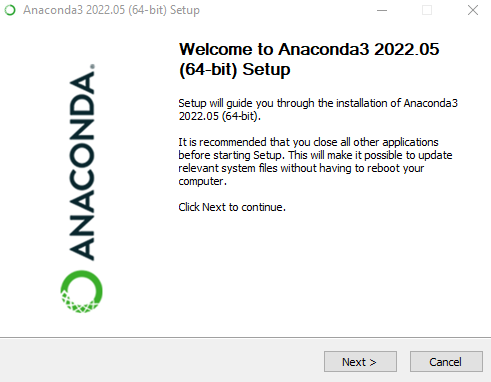
    
+ In the following setup dialogs you can (and probably should) accept all the defaults. **Be careful with this step!** Unles you have a good reason not to, please leave the first box unmarked, as illustrated here:     

    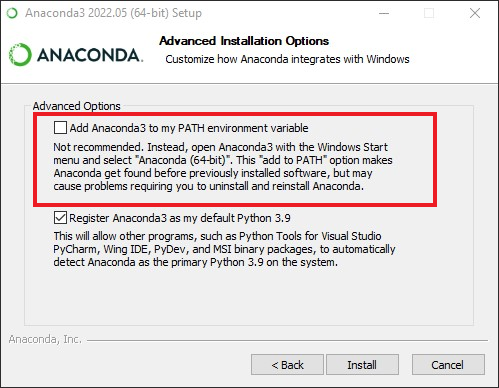
    
+ When setup is completed you will see something like this:

    
    
    Click on *Next* and do the same in the final dialogs (consisting in software ads and tutorials, we suggest to skip all of them). 


### Create a Conda Environment for the Course <a name="CreateCondaEnv"></a>

+ A conda environment allows us to organize our work in projects, keeping each project dependencies isolated from the rest of your work. It is also the best way to avoid running into the potentially catastrophic situation in where you have several Python versions and they conflict to [create a mess](https://xkcd.com/1987/). We urge you to **always use environments** to organize your work in Python. You can learn more about the use of Conda environments [in this link](https://docs.conda.io/projects/conda/en/latest/user-guide/tasks/manage-environments.html#). And to learn more about environments in Python in general, you can check these two links:
    + [A Guide to Python’s Virtual Environments](https://towardsdatascience.com/virtual-environments-104c62d48c54)
    + [The Definitive Guide to Conda Environments](https://towardsdatascience.com/a-guide-to-conda-environments-bc6180fc533)

+ We will be using a Conda environment named `fmad` for this course. To create the environment we will use the *Anaconda Terminal (or Anaconda Prompt)*. Hit the Windows key and begin typing *Anaconda*. You should see results like this: 

    
    
    The Anaconda Navigator is a GUI interface to manage your Anaconda setup. Some people like it a lot, but we will be using mostly the (old school) terminal-based command-line approach. Thus, start the *Anaconda Prompt* and a window like this one will open:

    
    
    This terminal window is where most of our *Python management* will occur (but not the actual coding!)
    
+ In that prompt execute the command 

    `conda create --name fmad`
    
    and after some moments something like this should happen  

    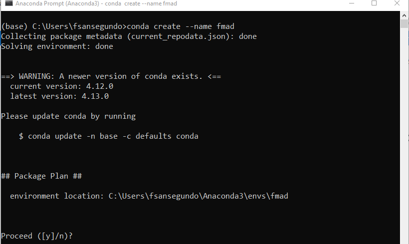
    
    For the time being ignore the warning about updating Conda it it appears (we will deal with it in the next step) and just answer *y* and hit *Enter*. A successful environment creation looks like:

    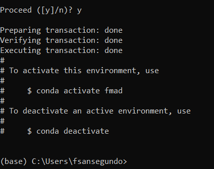
    

### Update conda

+ To update conda (if the warning appeared in the previous step) run this command:

    `conda update -n base -c defaults conda`
    
    As the following picture illustrates conda will present you with a summary of the update operation. Answer *y* and hit *Enter*.
    
     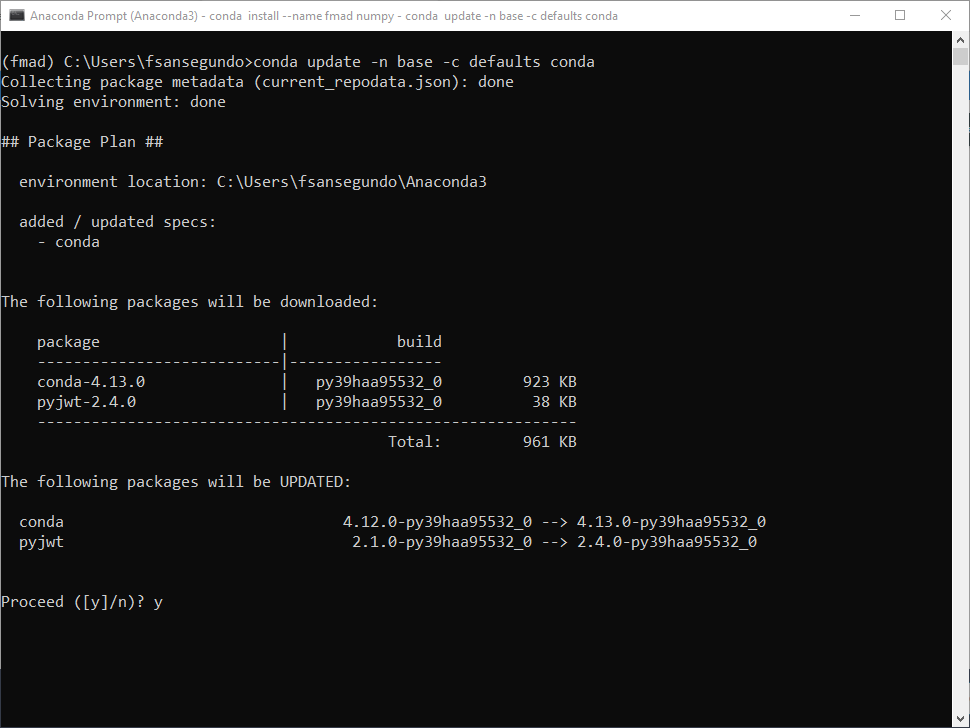
     
     Then conda will download the required software to autoupdate. The expected result looks like this:
     
     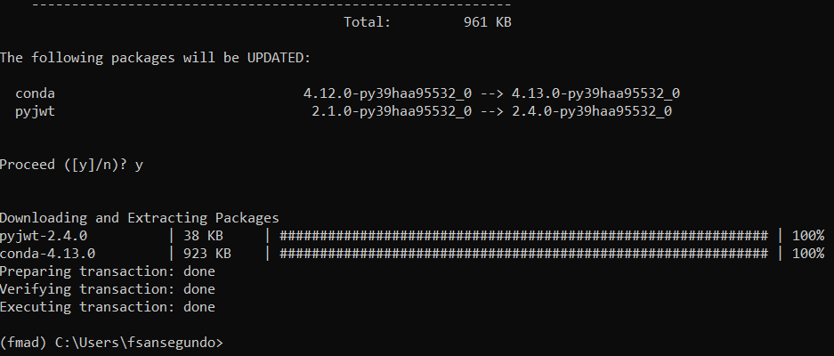

### Activate the environment   
    
+ When we created the `fmad` environment in a previous step, Conda showed us the activation command:  

    `conda activate fmad`
    
    Run this command now. This will activate the newly created environment `fmad`. Note that the name of the active environment appears in parenthesis at the beginning of the prompt line:

    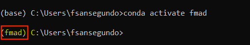
    
    **Make sure that the environment is correctly activated before proceeding!!** If you have any problem ask for help.
    

###  Install the first library

+ The first library that we will install is [NumPy](https://numpy.org), which provides the foundation for much of the work we will doing in this course. We will discuss NumPy in coming sessions of the course. But to use it we first need to install it in our `fmad` environment. Execute this command now:
    
    `conda install --name fmad numpy`
    
    A summary of the libraries that need to be downloaded for the NumPy setup will appear
    
    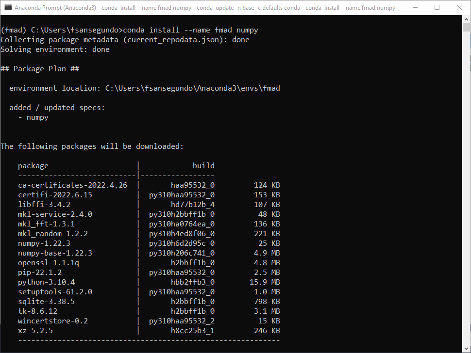
    
    followed by a rather lengthy list of the libraries about to be installed (in most cases these two lists are almost equal) 

     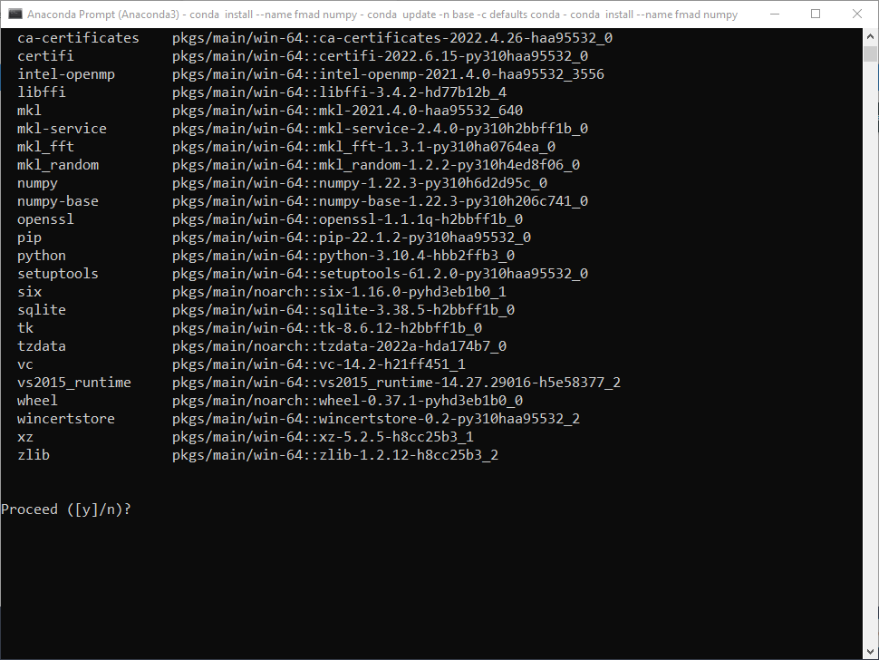
     
     Answer yes to make the setup begin and wait patiently while NumPy and all of its requirements are downloaded and installed. The proccess should end like this:
     
     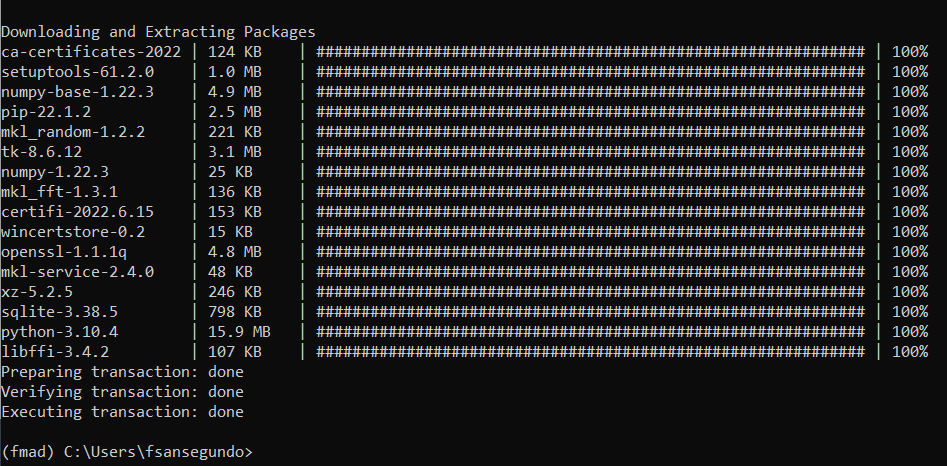     

###  Install aditional libraries

+ NumPy is just the first of the libraries that we will use in the course, but many others will also come into play. To name a few of the most relevant:

    + [NumPy](https://numpy.org)
    + [Pandas](https://pandas.pydata.org)
    + [MatPlotLib](https://matplotlib.org)
    + [Scikit-Learn](https://scikit-learn.org)
    + [Seaborn](https://seaborn.pydata.org)

  Take a few moments to visit the homepage for each of these libraries. 

**Exercise:** install all these libraries to the `fmad` environment. To install several libraries you don't need to repeat `conda install` for each library; you can use a single install command and separate the names of the libraries with a space.

### Install the Jupyter Notebook & Jupyter Lab

+ In this course we will talk to Python using the onterface provided by *Jupyter Notebooks*. The [Jupyter Project](https://jupyter.org) provides a general purpose development environment which is well suited for Python (but not limited to it). It will play a central role in our work with Python, but it installs (to the `fmad` environment) just like any other library.

    `conda install --name fmad jupyter`
    
+ When the setup ends execute the following two commands in order. The first one changes your current directory to your user folder in Windows. The second command opens the Jupyter Notebook in your *default Web Browser*:  

   `cd %HOMEPATH%`  
   `jupyter notebook &`

  Like this:
  
  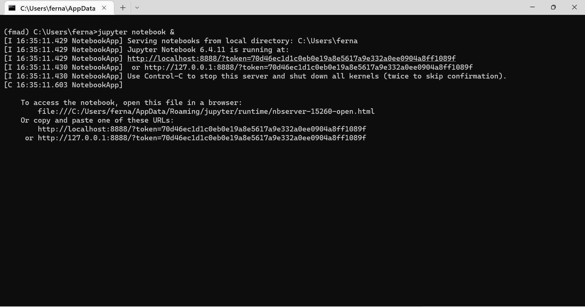
       
  *Note:* We recommend to always start Jupyter from a folder high enough in your folder structure: you won't be able to easily move up from the starting point later. Make sure, however, that you are at the very least, at the *Course folder* level. 
  
  In a few moments your default *Web Browser* will open to a new page that shows the entry point for the running Jupyter server that we have just started:

  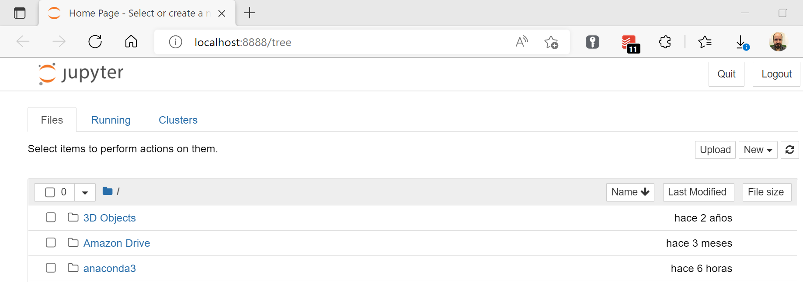
  
You can use that page to navigate your folder structure until you get to the *Course Folder*. Once you are seeing the contents of that folder, open the `01a_test_your_setup.ipynb` file and follow the instructions there. If errors appear try to go over the setup procedure again and if you are still having trouble ask for our help. 

### Additional Remarks for Windows Users

+ The terminal window that you used to start Jupyter should remain open during all the work session. **Be careful:** Closing it can make the server crash and you may lose part of your work.

+ Remember to make external copies of the files in `fmad2223` before modifying them.

+ When you are done with the setup checks use the `File` menu and then `Close and Halt` the notebook. If your browser asks for confirmation that you really want to close the page: don't worry, you can safely close it.

+ Every time you finish working with Jupyter you should go back to the `Home Page` of the Jupyter server (the one which shows your folder structure) and use the `Quit` button on the top right side of that window to shutdown Jupyter. A popup window will appear to inform you that you should close that browser tab.

+ Return to the terminal that you used to initiate Jupyter. You should now see some messsage confirming that the server is shut down. If you are done working in this Python environment, issue the command:

  `conda deactivate`
    
  The prompt will change to indicate that you are back to the `base` conda environment. You can now close the terminal window as well if you wish. 

## Alternative Setups <a name="AlternativeSetups"></a>

+ We have described how to set up your Windows machine using Anaconda Python, but you should know that there are other alternatives. For example, if you want a light weight setup without all the additional tools included with a full Ananconda setup, then you can consider [Miniconda](https://docs.conda.io/en/latest/miniconda.html). According to its official web site, miniconda is *a small, bootstrap version of Anaconda that includes only conda, Python, the packages they depend on, and a small number of other useful packages.* 
+ Both Anaconda and Miniconda are maintained by a commercial company, also called Anaconda. If you prefer a similar community based system you can take a look at [Miniforge](https://github.com/conda-forge/miniforge/#download), which is strongly associated with [Conda-Forge](https://conda-forge.org), a community driven GitHub organization containing repositories of conda recipes.
+ Finally, we want to mention the standard Python versions from [www.python.org](https://www.python.org). Using this Python version requires a different management system for Python environments and libraries. We won't be using this system in this course, but if for some reason you must use it, please let us know in advance so that we can provide you with the information you will need. I

# Using Jupyter Notebooks

+ The document you are reading now was created as a Jupyter Notebook. That is the basic tool that we will be using in this course to write our Python code. To create and read Jupyter Notebooks we use web browsers.    

+ A Jupyter notebook is structured in *cells*. There are two basic types of cells:
    + *Code cells* where you write and execute Python code.
    + *Markdown cells* that contain text, formulas, images, links that you can use to document the code. We will provide further information about markdown below. 

+ When you create a new notebook it will only contain (empty) code cells. You can convert any cell from code to markdown by selecting the cell and hiting the `M` key in your keyboard. You must be in Command mode to do this (see below). Converting the other way round (markdown to code) can be accomplished with the `Y` key. There are also menu options for type conversion in the `Cell` menu of the notebook interface.

+ Every time you run or render the *last* cell of your notebook a new cell will be added below. If you need to insert more cells somewhere in the notebook you can use the *Insert* menu. But the keyboard shortcuts `A` and `B` can also be used to add new cells `A`bove or `B`elow the active cell. For this to work you need to be in command mode, to be explained in the next item.

+ When using a Jupyter Notebook there is always an *active cell* which you can select with the mouse. The active cell (can be either code or markdown) is highlighted by a surrounding frame, and the color of frame indicates the *mode*:
    + *Edit mode (green)*. The cursor blinks inside the cell and lets you modify the contents of the cell. That is, we use this mode to write code or markdown depending of the cell type.
    + *Command mode (blue)*. This mode is used to operate on the contents of a cell as a whole. In this mode you can *run the code* in a code cell or you can *render the content* of a markdown cell. You can also use this mode to copy or move the cell, delete it, etc.
    
+ If you are in edit mode you can change to command mode hitting the `Esc` key (or clicking with your mouse outside the active cell). If you are in command mode you can change to edit mode with the `Enter` &#9166; key (or clicking inside the cell, double-click if it is not the active cell).

+ To run or render the content of the cell:
    + Make sure the cell is active (the mode is irrelevant).
    + Use the key combination Shift + Enter (&#8679; + &#9166;)
  If the cell contains Python code it will be executed. Keep in mind that if the code in that cell depends on the results of previous cells then they must also be executed beforehand. There are some useful options in the *Cell* menu of the notebook interface that will help you run the required parts of the notebook.

+ Besides the ones we have described there are many useful commands and keyboard shortcuts to ease the use of notebooks. Take a look at the *Help* menu. In particular, make sure to look at the *Keyboard Shortcuts* section of that menu.

## Markdown

+ Markdown is a very simple markup language that we use to modify the aspect of the text. For example, to make a sentence *render in italic* you just need to surround it with asterisks. And markdown is not specific of Jupyter notebooks. In fact its support is increasing as a basic tool for text formatting in many technical contexts. Learning the basics of markdown is a good idea. 

+ We recommend to open the source file of this or any other of the course Jupyter notebooks and look at some of the markdown cells (remember, use edit mode) to see how markdown was used to include sectioning commands (sections, subsections), figures, links, bullet lists, etc. If you know how to write $\LaTeX$ ([you can get a first impression here](https://ashki23.github.io/markdown-latex.html#latex)) you can use it to include nice mathematical equations in your markdown cells:
$$\int_{-\infty}^{\infty}e^{-x^2}dx = \sqrt{\pi}$$
By the way, the above result plays an important role in the normal distribution that we will be discussing soon.  
 *Note for Latex users.* you don't need a separate installation of LaTeX to use it in Jupyter notebooks, as it is provided by your browser through MathJax.
+ There are many markdown tutorials, mostly equivalent. This recent one focuses on the use of markdown for Jupyter notebooks: [12 things to know about Jupyter Notebook Markdown, by Dayal Chand Aichara](https://medium.com/game-of-data/12-things-to-know-about-jupyter-notebook-markdown-3f6cef811707)

## Jupyter extensions

+ If we need to install the extensions, please run this command:

```
conda install -n fmad jupyter_contrib_nbextensions
```
